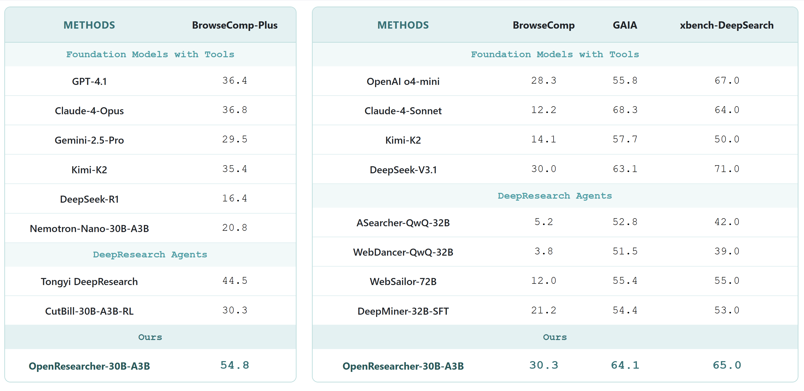

<p align="center">
  
  </p>

<div align="center" style="line-height: 1; margin-top: 16px;">

<div align="center">
    <a href="https://x.com/DongfuJiang/status/2020946549422031040"></a>
  <a href="https://boiled-honeycup-4c7.notion.site/OpenResearcher-A-Fully-Open-Pipeline-for-Long-Horizon-Deep-Research-Trajectory-Synthesis-2f7e290627b5800cb3a0cd7e8d6ec0ea?source=copy_link"></a>
    <a href="https://github.com/TIGER-AI-Lab/OpenResearcher"></a>
  <a href="https://huggingface.co/datasets/OpenResearcher/OpenResearcher-Dataset"></a>
  <a href="https://huggingface.co/OpenResearcher/OpenResearcher-30B-A3B"></a>
    <a href="https://huggingface.co/spaces/OpenResearcher/OpenResearcher"></a>
  <!-- <a href="https://wandb.ai/dongfu/nano-v3-sft-search"></a> -->
  <a href="https://huggingface.co/datasets/OpenResearcher/OpenResearcher-Eval-Logs/tree/main"></a>
</div>

</div>
<br>
<p align="center">
  🤗 <a href="https://huggingface.co/collections/TIGER-Lab/openresearcher" target="_blank">HuggingFace</a> ｜
 <a href="https://boiled-honeycup-4c7.notion.site/OpenResearcher-A-Fully-Open-Pipeline-for-Long-Horizon-Deep-Research-Trajectory-Synthesis-2f7e290627b5800cb3a0cd7e8d6ec0ea?source=copy_link" target="_blank">Blog</a> ｜ <a href="https://join.slack.com/t/openresearcher/shared_invite/zt-3p0r32cky-PqtZkVjjWIAI14~XwcRMfQ" target="_blank">Slack</a> |  <a href="assets/imgs/wechat_group.jpg" target="_blank">WeChat</a> 
</p>

## 💥 Introduction

**OpenResearcher** is a fully open agentic large language model (30B-A3B) designed for **long-horizon deep research** scenarios. It achieves an impressive **54.8%** accuracy on [BrowseComp-Plus](https://huggingface.co/spaces/Tevatron/BrowseComp-Plus), surpassing performance of `GPT-4.1`, `Claude-Opus-4`, `Gemini-2.5-Pro`, `DeepSeek-R1` and `Tongyi-DeepResearch`. We **fully open-source** the training and evaluation recipe—including data, model, training methodology, and evaluation framework for everyone to progress deep research.
<div align="center">
  
</div>

<br>

## 🏆 Deep Research Benchmark Results

<div align="center">
  
</div>


## ✨ Features
+ 🔑 **Fully Open-Source Recipe** — We fully open-source our 96K high-quality [DeepResearch trajectory dataset](https://huggingface.co/datasets/OpenResearcher/OpenResearcher-Dataset) with 100+ turns generated by GPT-OSS-120B with [native browser tools](https://docs.vllm.ai/projects/recipes/en/latest/OpenAI/GPT-OSS.html#usage:~:text=Limitation%20section%20below.-,Tool%20Use,-%C2%B6), the leading [30B-A3B model](https://huggingface.co/OpenResearcher/OpenResearcher-30B-A3B) trained on it, [distillation recipe](https://boiled-honeycup-4c7.notion.site/OpenResearcher-A-Fully-Open-Pipeline-for-Long-Horizon-Deep-Research-Trajectory-Synthesis-2f7e290627b5800cb3a0cd7e8d6ec0ea?source=copy_link), and a lightweight [DeepResearch evaluation framework](https://github.com/TIGER-AI-Lab/OpenResearcher) to progress deep research.

+ 💰 **Highly Scalable and Low-Cost** — We generate DeepResearch trajectories at massive scale using self-built retriever over a dedicated ~11B-token [corpus](https://huggingface.co/datasets/OpenResearcher/OpenResearcher-Corpus), eliminating the need for external Search APIs. This scalable retriever significantly reduces training costs.

+ 🚀 **Remarkable Performance on Deep Research Benchmarks** — OpenResearcher demonstrates leading performance across a range of deep research benchmarks, including BrowseComp-Plus, BrowseComp, GAIA, xbench-DeepSearch.

## 📋 Table of Contents

- [🛠 Environment Setup](#-environment-setup)
  - [Installation](#installation)
  - [Deep Research Benchmarks Preparation](#deep-research-benchmarks-preparation)
- [🔍 Configuration](#-configuration)
- [🚀 Quick Start](#-quick-start)
- [🔬 Benchmark OpenResearcher](#-benchmark-openresearcher)
  - [Example 1: BrowseComp-Plus with Local Search Engine](#example-1-browsecomp-plus-with-local-search-engine)
  - [Example 2: GAIA with Serper API (No Local Search Needed)](#example-2-gaia-with-serper-api-no-local-search-needed)
  - [Evaluation](#evaluation)
  - [Quick Commands](#quick-commands)
- [🤝 Core Contributors](#-core-contributors)
- [🎓 Advisors](#-advisors)
- [🙏 Acknowledgements](#-acknowledgements)
- [✨ Contributing](#-contributing)
- [📚 Citation](#-citation)
## 🛠 Environment Setup
We run this repo on the following setup:
+ 8 * A100 80G Nvidia GPUs
+ Linux operating system

Other hardware setups can also work, but remember to modify the corresponding parameters.
### Installation 
```bash
sudo apt update 
sudo apt install -y openjdk-21-jdk

# install uv
curl -LsSf https://astral.sh/uv/install.sh | sh
uv venv --python 3.12
source .venv/bin/activate

# install tevatron for BrowseComp-plus 
git clone https://github.com/texttron/tevatron.git
cd tevatron
uv pip install -e .
cd ..

# install all dependencies automatically
uv pip install -e .
```

### Deep Research Benchmarks Preparation

Run the setup script to automatically download the **[BrowseComp-Plus](https://arxiv.org/abs/2508.06600)** benchmark. Other benchmarks, including **[BrowseComp](https://arxiv.org/abs/2504.12516)**, **[GAIA](https://arxiv.org/abs/2311.12983)** and **[xbench-DeepResearch](https://github.com/THUDM/xbench)**, will be set up automatically when they are first used.

```bash
bash setup.sh
```

**This script will:**
- ✅ Verify Python 3.12 virtual environment and automatically install any missing dependencies
- ✅ Downlaod BrowseComp-Plus dataset from HuggingFace and set up the directory structure

For more info about these deep research benchmarks, see [benchmarks.md](assets/docs/benchmarks.md) 

## 🔍 Configuration

Copy the template and configure your API keys:

```bash
cp .env.template .env
```

Edit `.env`:
```bash
# Serper API (for web search when using browser_backend=serper)
SERPER_API_KEY=your_key        # Get from: https://serper.dev/

# OpenAI API (for evaluation scoring)
OPENAI_API_KEY=your_key        # Get from: https://platform.openai.com/api-keys
```


## 🚀 Quick Start
**Prerequisites:** Install dependencies and configure API keys (see [Environment Setup](#-environment-setup) and [Configuration](#-configuration))

1. **Deploy OpenResearcher-30B-A3B**:

```bash
bash scripts/start_nemotron_servers.sh
```

The complete vLLM server logs can be found in the `logs` directory.

2. **Run your first task** (Before proceeding, check the logs in `logs` directory to ensure the vLLM server is deployed.)

```python
import asyncio
from deploy_agent import run_one, BrowserPool
from utils.openai_generator import OpenAIAsyncGenerator

async def main():
    # Initialize generator and browser
    generator = OpenAIAsyncGenerator(
        base_url="http://localhost:8001/v1",
        model_name="OpenResearcher/OpenResearcher-30B-A3B",
        use_native_tools=True
    )
    browser_pool = BrowserPool(search_url=None, browser_backend="serper")

    # Run deep research
    await run_one(
        question="What is the latest news about OpenAI?",
        qid="quick_start",
        generator=generator,
        browser_pool=browser_pool,
    )

    browser_pool.cleanup("quick_start")

if __name__ == "__main__":
    asyncio.run(main())
```

The deep research agent will automatically search the web, browse webpages, and extract relevant information. You'll see the final answer along with all intermediate reasoning steps.


## 🔬 Benchmark OpenResearcher
We benchmark our OpenResearcher-30B-A3B using below deep research benchmarks: 

| Benchmark | Dataset Key | Size | Language | Search Backend | Description |
|-----------|-------------|------|----------|----------------|-------------|
| [BrowseComp-Plus](https://arxiv.org/abs/2508.06600) | `browsecomp_plus` | 830 | EN | local | Deep-research benchmark from BrowseComp isolating retriever and LLM agent effects |
| [BrowseComp](https://arxiv.org/abs/2504.12516) | `browsecomp` | 103 | EN | serper | A Simple Yet Challenging Benchmark for Browsing Agents |
| [GAIA-text](https://arxiv.org/abs/2311.12983) | `gaia` | 103 | EN | serper | Text-only subset of GAIA benchmark (dev split) |
| [xbench-DeepResearch](https://github.com/THUDM/xbench) | `xbench` | 100 | ZH | serper | DeepSearch benchmark with encrypted test cases |

For more info about these deep research benchmarks, see [benchmarks.md](assets/docs/benchmarks.md) 

### Example 1: BrowseComp-Plus with Local Search Engine

Complete evaluation using local dense search with browsecomp-plus [corpus](https://huggingface.co/datasets/Tevatron/browsecomp-plus-corpus) and [embeddings](https://huggingface.co/datasets/Tevatron/browsecomp-plus-indexes/tree/main/qwen3-embedding-8b) (**note: only applicable for BrowseComp-Plus**):

```bash
# Terminal 1: Start local Dense search service on port 8000
# Embedding model (Qwen3-Embedding-8B) will be deployed on GPUs 7
bash scripts/start_search_service.sh dense 8000

# Terminal 2: Start vLLM servers (requires 4 GPUs)
# TP=2, deploy 2 servers starting from port 8001 on GPUs 0,1,2,3
bash scripts/start_nemotron_servers.sh 2 8001 0,1,2,3

# Terminal 3: Run agent
bash run_agent.sh results/browsecomp_plus/OpenResearcher_dense 8001 2 browsecomp_plus local OpenResearcher/OpenResearcher-30B-A3B
```

What this does:
- Deploys Dense retriever service on port 8000 as search engine
- Launches 2 vLLM servers (ports 8001, 8002) with TP=2 across 4 GPUs
- Runs deepresearch agent with load balancing across both servers

### Example 2: GAIA with Serper API (No Local Search Needed)

Run with Serper Google Search API (**note: applicable to all benchmarks except BrowseComp-Plus**):

```bash
# Terminal 1: Start vLLM servers (requires 4 GPUs)
bash scripts/start_nemotron_servers.sh 2 8001 0,1,2,3

# Terminal 2: Run agent with serper search backend
bash run_agent.sh results/gaia/OpenResearcher_serper 8001 2 gaia serper OpenResearcher/OpenResearcher-30B-A3B
```

**Browser Backend Options:**
- `local` - Use local BM25/Dense search service (for BrowseComp-Plus)
- `serper` - Use Serper Google Search API (for all other benchmarks)

For other parameters, refer to [parameter.md](assets/docs/parameter.md).

### Evaluation

After running experiments, evaluate results:

```bash
# eval on browsecomp_plus
python eval.py --input_dir results/browsecomp_plus_dense/OpenResearcher_dense

# eval on gaia
python eval.py --input_dir results/gaia/OpenResearcher_serper
```

### Quick Commands

| Scenario | Command |
|----------|---------|
| BrowseComp-Plus (BM25) | `bash scripts/start_search_service.sh bm25 8000` then `bash scripts/start_nemotron_servers.sh 2 8001 0,1,2,3` then `bash run_agent.sh results/browsecomp-plus/OpenResearcher_bm25 8001 2 browsecomp_plus local OpenResearcher/OpenResearcher-30B-A3B` |
| BrowseComp-Plus (Qwen3-8B Dense Embeddings) | `bash scripts/start_search_service.sh dense 8000` then `bash scripts/start_nemotron_servers.sh 2 8001 0,1,2,3` then `bash run_agent.sh results/browsecomp-plus/OpenResearcher_dense 8001 2 browsecomp-plus local OpenResearcher/OpenResearcher-30B-A3B` |
| BrowseComp | `bash scripts/start_nemotron_servers.sh 2 8001 0,1,2,3` then `bash run_agent.sh results/browsecomp 8001 2 browsecomp serper OpenResearcher/OpenResearcher-30B-A3B` |
| GAIA | `bash scripts/start_nemotron_servers.sh 2 8001 0,1,2,3` then `bash run_agent.sh results/gaia 8001 2 gaia serper OpenResearcher/OpenResearcher-30B-A3B` |
| xbench-DeepResearch | `bash scripts/start_nemotron_servers.sh 2 8001 0,1,2,3` then `bash run_agent.sh results/xbench 8001 2 xbench serper OpenResearcher/OpenResearcher-30B-A3B` |

For script parameter explanation, refer to [parameter.md](assets/docs/parameter.md).

**Note:** Don't forget to evaluate your results using:  
```bash
python eval.py --input_dir [INPUT_DIR]
```
## 🤝 Core Contributors

<table>
<tr>
    <td align="center">
        <a href="https://zhuofeng-li.github.io/">
            
            <br />
            <sub><b>Zhuofeng Li</b></sub>
        </a>
    </td>
        <td align="center">
        <a href="https://github.com/jdf-prog">
            
            <br />
            <sub><b>Dongfu Jiang</b></sub>
        </a>
    </td>
    </td>
        <td align="center">
        <a href="https://mxueguang.github.io/">
            
            <br />
            <sub><b>Xueguang Ma</b></sub>
        </a>
    </td>
    <td align="center">
        <a href="https://isaacghx.github.io/about/">
            
            <br />
            <sub><b>Haoxiang Zhang</b></sub>
        </a>
    </td>
    <td align="center">
        <a href="https://github.com/erenup">
            
            <br />
            <sub><b>Ping Nie</b></sub>
        </a>
    </td>
</tr>
</table>

## 🎓 Advisors

<table>
<tr>
      <td align="center">
        <a href="https://github.com/wenhuchen">
            
            <br />
            <sub><b>Wenhu Chen</b></sub>
        </a>
    </td>
    <td align="center">
        <a href="https://yuzhimanhua.github.io/">
            
            <br />
            <sub><b>Yu Zhang</b></sub>
        </a>
    </td>
</tr>
</table>

## 🙏 Acknowledgements
We thank [Lambda](https://lambda.ai), [Netmind AI](https://www.netmind.ai/) and [Verdent AI](https://www.verdent.ai) for GPU and API support!


## ✨ Contributing
We are truly looking forward to open-source contributions to OpenResearcher! If you’re interested in contributing, collaborating, or reporting issues, please feel free to open an issue or submit a pull request (PR). You can also reach us at [zhuofengli12345@gmail.com](mailto:zhuofengli12345@gmail.com).

We are also looking forward to your feedback and suggestions!

##  📚 Citation

```bibtex
@misc{li2025openresearcher,
  title={OpenResearcher: A Fully Open Pipeline for Long-Horizon Deep Research Trajectory Synthesis},
  author={Zhuofeng Li and Dongfu Jiang and Xueguang Ma and Haoxiang Zhang and Ping Nie and Yuyu Zhang and Kai Zou and Jianwen Xie and Yu Zhang and Wenhu Chen},
  year={2025},
  howpublished={\url{https://www.notion.so/OpenResearcher-A-Fully-Open-Pipeline-for-Long-Horizon-Deep-Research-Trajectory-Synthesis-2f7e290627b5800cb3a0cd7e8d6ec0ea}},
  note={Notion Blog}
}
```


